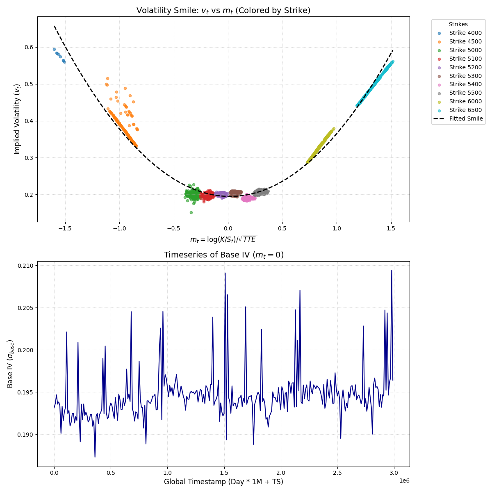
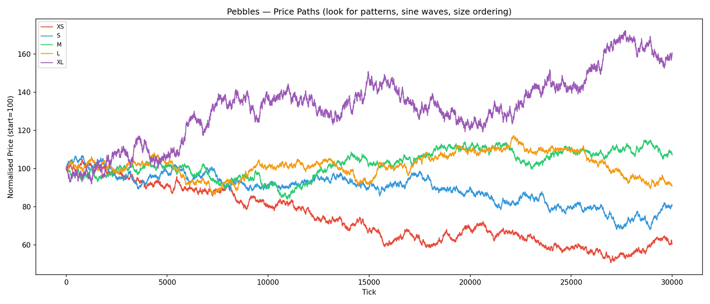
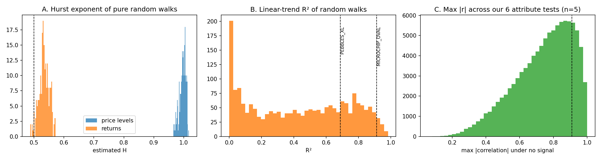

# IMC Prosperity 4 — Team Smashcoins

**Final standing: 1,032nd of 18,803 teams (top 5.5%), with 211,804 XIRECs in Phase 2.** Best standing: **772nd**, after Round 4.

IMC Prosperity 4 is a five-round algorithmic and manual trading competition. Each round, teams submit a Python trading bot that runs against a simulated exchange, plus a manual trading decision. This repository holds our strategies, research figures, a written report and a post-mortem notebook.

- 📄 **Report (PDF):** [`report/report.pdf`](report/report.pdf)
- 📓 **Notebook:** [`notebook/IMC_Prosperity4_SMASHCOINS.ipynb`](notebook/IMC_Prosperity4_SMASHCOINS.ipynb)
- 🐍 **Code by round:** [`code/`](code/)

## Team

| Member | Programme (HKUST) | Main contribution |
|---|---|---|
| POON Ka Hang (Jack) | BEng, Computer Science and Mathematics (double major), Business minor | Rounds 1–2 algorithm; options and volatility-smile strategies (Rounds 3–5); Round 5 product classification |
| SIT Chak Hong (Ivan) | BSc, Biotechnology and Mathematics (double major), Business minor | Non-options strategies from Round 3 (`HYDROGEL_PACK`, `VELVETFRUIT_EXTRACT`); Round 5 products without a clear strategy |
| LIN Hao Kun (Jacky) | BEng, Computer Science, Extended Major in Artificial Intelligence | Manual trading, Rounds 3–5 |
| CHAN Yui San (Terrence) | BSc, Physics | Manual trading, Rounds 3–5 | 

## Results

Rounds 1–2 were qualifiers (200,000 XIRECs needed to continue); the leaderboard then reset for Phase 2. We didn't record profit for Rounds 1 and 2.

| Round | Algorithmic PnL | Manual PnL | Round PnL | Overall rank after round |
|---|---|---|---|---|
| 1 | not recorded | not recorded | not recorded | — |
| 2 | not recorded | not recorded | not recorded | qualified for Phase 2 |
| 3 | 37,318 (879th in round) | 75,529 (230th in round) | 112,847 | 845 |
| 4 | 37,236 (995th in round) | 45,309 (445th in round) | 82,544 | **772** |
| 5 | 39,567 | −23,154 | 16,413 | **1,032 (final)** |

## What we did, round by round

**Rounds 1–2 — market making (Jack).** An EMA-smoothed, volume-weighted fair price with inventory skew, a volatility-scaled spread, aggressive taking through fair value and penny-jumped passive quotes. In hindsight the bot capped positions at 20 against an exchange limit of 80 and skipped the Round 2 `bid()` auction for extra volume.

**Round 3 — fair-value models and a first volatility smile.** Ivan built the `HYDROGEL_PACK` strategy: a Bayesian fair value updated from trade prints, with volatility-scaled entry thresholds. Jack fitted a volatility smile across ten call vouchers by plotting implied volatility against log-moneyness scaled by √TTE, but the trading version wasn't ready in time. Jacky and Terrence solved the manual auction by expected value (best bid 790–795) and game theory on the field's bids, finishing 230th in the manual round.

**Round 4 — implied-volatility smile scalper (our best round).** Jack's bot prices each voucher off the fitted smile, inverts market prices to implied volatility by bisection (pure Python), trades the residual with entry/exit hysteresis and conviction sizing, and hedges delta with the underlying under a portfolio delta budget, which stops the book from building more delta than the hedge can absorb. The manual team priced every option with a Monte Carlo engine and bought a long-volatility portfolio. A post-mortem rerun showed the engine counted expiries in calendar days; with the official trading-day expiries the options were fairly priced, so the manual profit came from the simulated paths rather than an edge. Rank improved from 845 to 772.

**Round 5 — fifty new products.** We screened 50 products on Hurst exponent, autocorrelation, spread, drift, skew and kurtosis, then split them between market making, directional holds and pairs trading, with per-product parameter search. The market maker adapts open-source Prosperity 3 code by team Frankfurt Hedgehogs. The algorithm made +39,567, but the manual news trade lost 23,154: five of seven calls were right, yet spreading the whole budget cost 161,800 in quadratic fees. We finished 1,032nd.

<p align="center"> </p>

## Post-mortem

After the competition we re-ran our Round 5 evidence against pure noise. On simulated random walks with no signal at all:

- **Hurst on price levels is about 1.0** (median 0.998), versus about 0.53 on returns. Our screen used levels, which is why 46 of 50 products looked "trending".
- **Linear trends fit noise well:** 26% of 30,000-tick random walks have R² above 0.7, roughly 13 of every 50 products.
- **Five products per family can't confirm a pattern:** across our six attribute tests, a correlation of 0.91 or more appears 17% of the time by chance.
- **Best-of-eight parameter search** inflates a zero-edge backtest by 1.0–1.4 standard deviations.
- **Manual mistakes were about rules, not views:** a calendar-day expiry made Round 4's options look 16–34% cheap, and in Round 5 a v% allocation needed more than a v% move to cover its fee.

Next time: hold out a day, test returns rather than prices, log live profit per product, check units against the rules, size positions to the fees, and use every position limit and mechanism a round offers. The notebook reproduces every number above with fixed seeds.



## Repository layout

```
code/
  round2_market_maker.py            # Rounds 1–2 market maker (Round 1 file not kept)
  round3_bayesian_mean_reversion.py # Round 3 submission
  round4_iv_smile_scalper.py        # Round 4 options and delta-hedging component
  round4_manual_options_engine.py   # Round 4 manual Monte Carlo pricing engine
  round5_market_maker.py            # Round 5 market-making component
  round5_directional_hold.py        # Round 5 directional component
figures/                            # research charts and results
notebook/IMC_Prosperity4_SMASHCOINS.ipynb
report/report.tex, report/report.pdf
```

The bots import `datamodel` from the official IMC Prosperity 4 starter files, which are not included here.

## Acknowledgements

Rules and product descriptions come from the official Prosperity 4 wiki. The Round 5 market maker adapts open-source Prosperity 3 code by team Frankfurt Hedgehogs. Research scripts and code were developed with help from AI coding assistants; strategy choices, parameters and submissions were our own.
